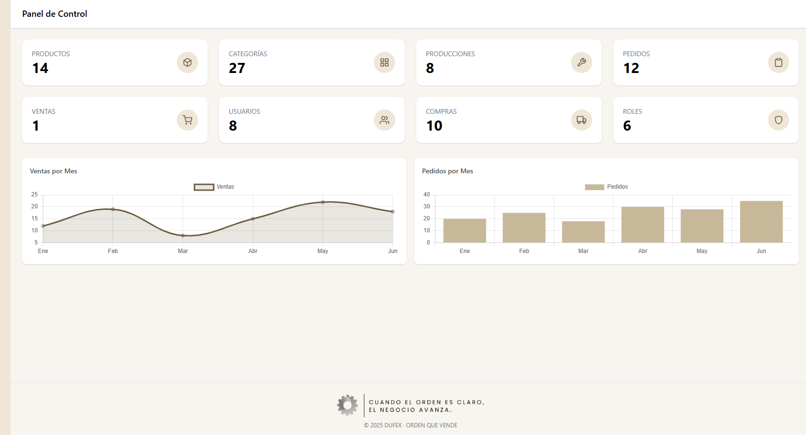
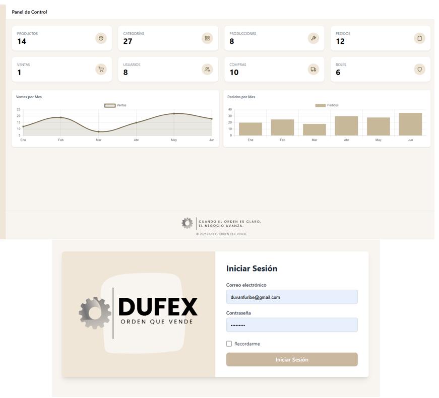
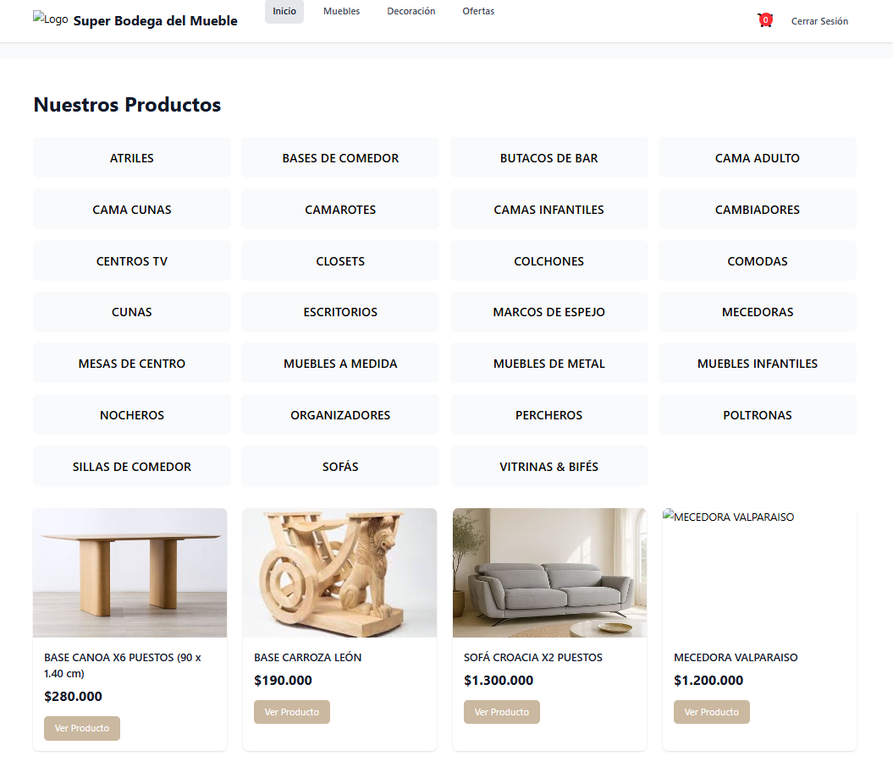
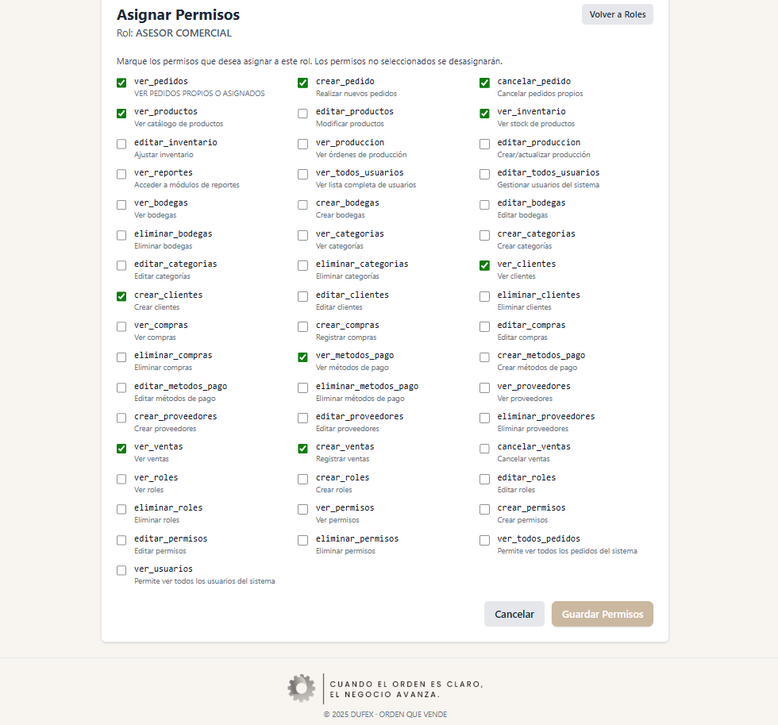
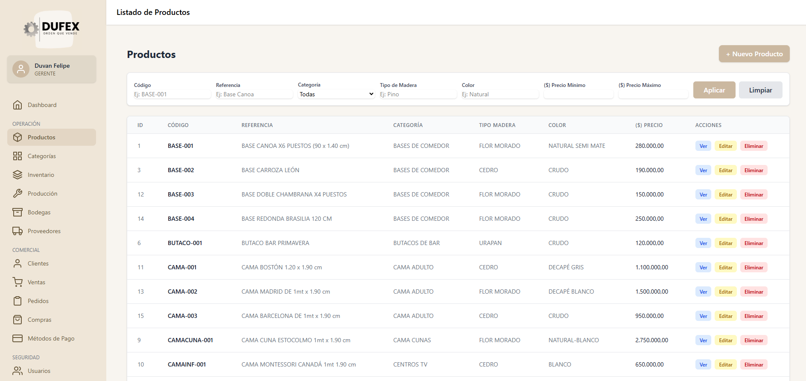
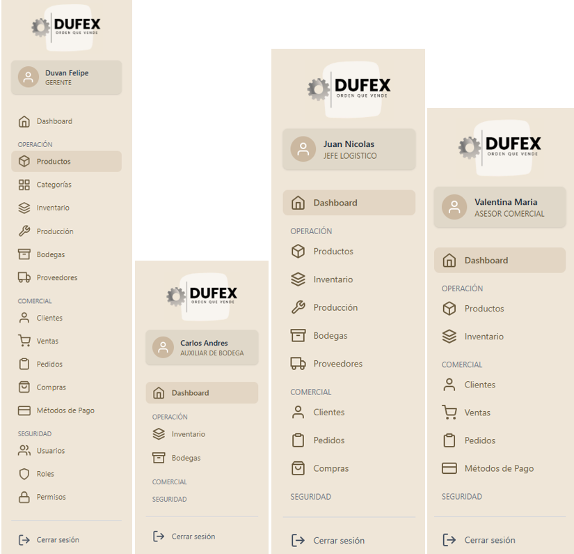

# 🛒 DUFEX — Sistema de Gestión Comercial (ORDER RAE)
> *Orden que vende — Desarrollado por Duvan Felipe Uribe*

---

## Descripción General

**DUFEX** es un sistema de gestión integral para pequeñas y medianas empresas del sector muebles y hogar, diseñado para gestionar:

- Productos y categorías  
- Inventario y bodegas  
- Compras y proveedores  
- Ventas, pedidos y clientes  
- Producción y usuarios  
- Permisos y roles  

Todo ello con una **interfaz moderna, responsive y funcional**, basada en **filtros multicriterio horizontales**, **dashboard visual con gráficos interactivos** y **control de acceso por roles y permisos**.

Este proyecto fue construido a partir de una **base de datos real migrada a Laravel**, con énfasis en **buenas prácticas de modelado relacional, seguridad y usabilidad**.

---

## Arquitectura y Tecnologías

### Backend
- **Laravel 12** — Framework PHP moderno, estructurado y escalable.
- **Eloquent ORM** — Modelos con relaciones complejas (belongsTo, hasMany, belongsToMany).
- **Soft Deletes** — Eliminación lógica en todas las entidades clave.
- **Validaciones personalizadas** — Reglas de negocio en Request y Controlador.
- **Middleware de permisos** — Control de acceso granular por rol y acción.
- **Migraciones y Seeders** — Base de datos estructurada y poblada automáticamente.
- **Vistas SQL** — Consultas optimizadas para reportes de ventas y análisis.

### Frontend
- **Tailwind CSS** — Estilos modernos, responsivos y coherentes.
- **Feather Icons / Chart.js** — Interfaz visual con iconos y gráficos dinámicos.
- **Blade Templates** — Estructura modular y reutilizable.
- **Filtros Multicriterio Horizontales** — Búsqueda avanzada en todos los módulos.
- **Dashboard con Gráficos** — Visualización de métricas clave (ventas mensuales, productos por categoría, estado de ventas).

### Funcionalidades Clave

**Filtros Avanzados**  
Cada módulo (Productos, Clientes, Compras, Ventas, etc.) cuenta con un panel de filtros horizontal que permite buscar por múltiples criterios (fechas, rangos numéricos, texto parcial, estados, relaciones).

**Dashboard Visual**  
Panel de control con:
- Tarjetas de métricas (total de productos, ventas, usuarios, etc.)
- Gráficos de líneas (ventas mensuales)
- Gráficos de barras (pedidos por mes)

**Control de Acceso por Roles y Permisos**  
Sistema de autorización flexible:
- Roles (Gerente, Asesor, Jefe Logistico, etc.)
- Permisos granulares (ver_productos, crear_ventas, editar_clientes, etc.)
- Sidebar dinámico que muestra solo los módulos permitidos.
- Nombre y rol del usuario visible en el sidebar.

**Eliminación Lógica y Auditoría**  
Todos los módulos principales soportan `SoftDeletes`, manteniendo integridad referencial y permitiendo recuperación de registros.

**Relaciones Complejas**  
Modelos interconectados:
- Producto → Categoría, Inventario, DetalleVenta, DetalleCompra
- Pedido → Cliente, Usuario, Venta
- Compra → Proveedor, Usuario, DetalleCompra
- Inventario → Producto, Bodega, Proveedor

**Interfaz Consistente y Profesional**  
Diseño uniforme en todos los módulos, con colores corporativos y componentes reutilizables.

## 💻 Capturas del Sistema

---

## Autor

**Duvan Felipe Uribe**  
Estudiante de Análisis y Desarrollo de Software — SENA  
📍 Colombia | Bogotá

---

## ¿Cómo usarlo?

1. Clona el repositorio.
2. Ejecuta `composer install`.
3. Configura `.env` con tus credenciales de MySQL.
4. Ejecuta `php artisan migrate --seed`.
5. Ejecuta `npm install && npm run dev` (si necesitas compilar assets).
6. Ejecuta `php artisan serve`.
7. Accede a `http://localhost:8000` y ¡listo!

---

## Aprendizajes Clave

Este proyecto demuestra mi capacidad para:

- Diseñar y modelar bases de datos relacionales complejas.
- Implementar patrones de diseño (CRUD, Repository, Service Layer implícito).
- Gestionar permisos y roles con lógica de negocio.
- Crear interfaces web modernas y funcionales con Laravel + Tailwind.
- Optimizar consultas con vistas SQL y relaciones Eloquent.
- Aplicar buenas prácticas de seguridad y mantenibilidad.

---

> 🚀 DUFEX es el núcleo de un sistema comercial en evolución, que seguiré desarrollando hasta convertirlo en un software listo para el mercado. Cada línea de código refleja mi compromiso con la calidad, la escalabilidad y la solución de problemas reales para diferentes sectores.

